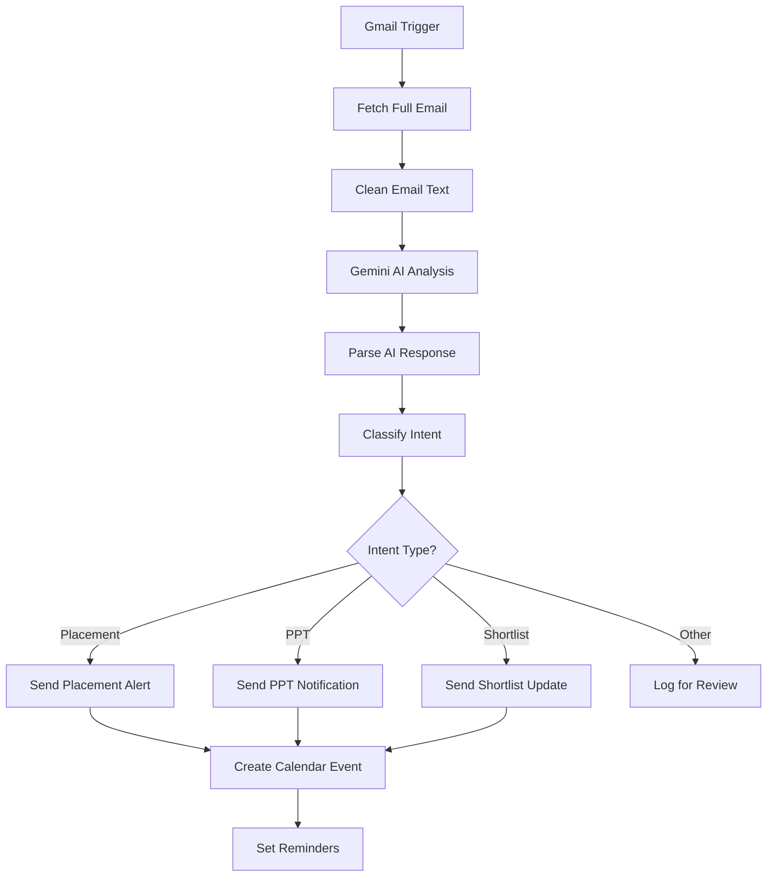

# 🚀 Placement Notifier - AI-Powered Email Automation

<div align="center">


**Automate your placement journey with AI-powered email analysis, instant notifications, and smart calendar management!**

[](https://github.com/Ndokania29/placement-notifier)
[](https://github.com/Ndokania29/placement-notifier)
[](https://github.com/Ndokania29/placement-notifier/issues)

</div>

---

## ✨ **What This Workflow Does**

This intelligent automation system transforms your placement email management from manual chaos to automated bliss:

- 🔍 **Smart Email Monitoring** - Watches your Gmail every minute for placement-related emails
- 🤖 **AI-Powered Analysis** - Uses Google's Gemini AI to intelligently parse and categorize emails
- 📱 **Instant Notifications** - Telegram alerts for new opportunities, deadlines, and updates
- 📅 **Auto Calendar Management** - Creates events with reminders for tests, interviews, and deadlines
- 🎯 **Smart Classification** - Automatically categorizes emails as Placement, PPT, Shortlist, or Other
- ⚡ **Real-time Processing** - No more missing deadlines or forgetting important dates!

---

## 🎯 **Perfect For**

- 🎓 **Students** seeking placement opportunities
- 💼 **Job seekers** managing multiple applications
- 🏢 **HR professionals** tracking recruitment processes
- 📧 **Anyone** drowning in placement-related emails

---

## 🚀 **Quick Start**

### **Prerequisites**
- [n8n](https://n8n.io/) account (self-hosted or cloud)
- Gmail account
- Google Cloud Project with Gemini API access
- Telegram Bot
- Google Calendar account

### **1. Import the Workflow**
1. Open your n8n instance
2. Click **Import from File**
3. Upload `Placement Notifier (1).json`
4. The workflow will be imported with placeholder credentials

---

## 🔐 **Quick Setup Guide**

<div align="center">

| 🚀 Service | 📋 Steps | ⚠️ Status |
|------------|----------|------------|
| **📧 Gmail API** | Enable API → Create OAuth → Add to n8n | Needs Setup |
| **🤖 Gemini AI** | Enable API → Get Key → Add to n8n | Needs Setup |
| **📱 Telegram Bot** | Message @BotFather → Get Token → Add to n8n | Needs Setup |
| **📅 Google Calendar** | Enable API → Create OAuth → Add to n8n | Needs Setup |

</div>

### **📧 Gmail API Setup**
1. Go to [Google Cloud Console](https://console.cloud.google.com/)
2. Enable **Gmail API** and create OAuth 2.0 credentials
3. Download JSON file and add to n8n Gmail OAuth2 credentials
4. Replace `YOUR_GMAIL_CREDENTIAL_ID` in workflow

### **🤖 Gemini AI Setup**
1. Enable **Gemini API** in Google Cloud Console
2. Get API key from AI Studio
3. Add to n8n Google PaLM API credentials
4. Replace `YOUR_GEMINI_API_CREDENTIAL_ID` in workflow

### **📱 Telegram Bot Setup**
1. Message [@BotFather](https://t.me/botfather) → `/newbot`
2. Get bot token and chat ID
3. Add to n8n Telegram API credentials
4. Replace `YOUR_TELEGRAM_CREDENTIAL_ID` and `YOUR_TELEGRAM_CHAT_ID`

### **📅 Google Calendar Setup**
1. Enable **Google Calendar API** in Google Cloud Console
2. Create OAuth 2.0 credentials
3. Add to n8n Google Calendar OAuth2 credentials
4. Replace `YOUR_GOOGLE_CALENDAR_CREDENTIAL_ID` in workflow

## 🔧 **Workflow Configuration**

### **Replace All Placeholders**
```json
{
  "YOUR_GMAIL_CREDENTIAL_ID": "actual_gmail_credential_id",
  "YOUR_GEMINI_API_CREDENTIAL_ID": "actual_gemini_credential_id",
  "YOUR_TELEGRAM_CREDENTIAL_ID": "actual_telegram_credential_id",
  "YOUR_GOOGLE_CALENDAR_CREDENTIAL_ID": "actual_calendar_credential_id",
  "YOUR_TELEGRAM_CHAT_ID": "your_actual_chat_id",
  "YOUR_EMAIL@gmail.com": "your_actual_email@gmail.com"
}
```

### **Customize Notification Messages**
Edit the Telegram notification nodes to personalize your messages and add your own branding.

---

## 📊 **How It Works**



---

## 🎨 **Features Breakdown**

### **🔍 Email Intelligence**
- **Smart Parsing:** Extracts company names, dates, deadlines, and event details
- **Intent Classification:** Automatically categorizes emails by purpose
- **Urgency Detection:** Determines priority based on dates and deadlines

### **📱 Smart Notifications**
- **Instant Alerts:** Real-time Telegram notifications
- **Rich Formatting:** Markdown-formatted messages with emojis
- **Contextual Information:** Company details, dates, times, and summaries

### **📅 Calendar Automation**
- **Auto Event Creation:** Schedules tests, interviews, and deadlines
- **Smart Reminders:** 10 and 30-minute popup notifications
- **Color Coding:** Different colors for different event types

---

## 🚨 **Troubleshooting**

### **Common Issues & Solutions**

| Issue | Solution |
|-------|----------|
| Gmail authentication fails | Check OAuth scopes and consent screen |
| Gemini API errors | Verify API key and billing setup |
| Telegram not sending | Check bot token and chat ID |
| Calendar events not created | Verify Calendar API permissions |


---

## 🔒 **Security & Privacy**

- ✅ **No data stored** - All processing happens in real-time
- ✅ **OAuth 2.0** - Secure authentication with Google services
- ✅ **Local processing** - Your emails stay private
- ✅ **Configurable** - You control what data is shared

---

## 🤝 **Contributing**

We welcome contributions! Here's how you can help:

1. 🐛 **Report bugs** by opening an issue
2. 💡 **Suggest features** in discussions
3. 🔧 **Submit pull requests** for improvements
4. 📚 **Improve documentation** and examples

### **Development Setup**
```bash
git clone https://github.com/Ndokania29/placement-notifier.git
cd placement-notifier
# Make your changes and submit a PR!
```

---


##  **Acknowledgments**

- **n8n** for the amazing workflow automation platform
- **Google Gemini AI** for intelligent email analysis
- **Telegram** for reliable messaging infrastructure
- **Open source community** for inspiration and support

---

## 📞 **Contact & Support**

- 📧 **Email:** [niveshdokania.29@gmail.com](mailto:niveshdokania.29@gmail.com)
- 🐙 **GitHub:** [@Ndokania29](https://github.com/Ndokania29)
- 💼 **LinkedIn:** [Nivesh Dokania](https://www.linkedin.com/in/nivesh-dokania-a9141725b)

---

<div align="center">

[](https://github.com/Ndokania29)
[](https://www.linkedin.com/in/nivesh-dokania-a9141725b)
[](mailto:niveshdokania.29@gmail.com)

</div> 